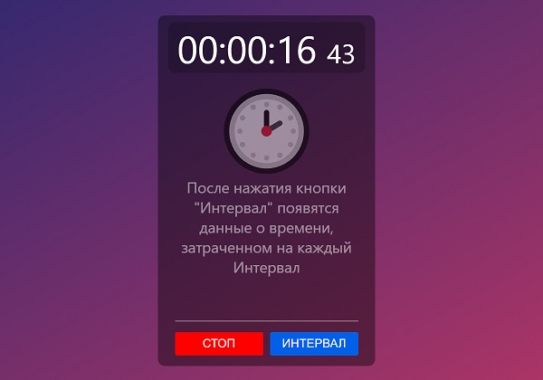

Stopwatch with React and Redux
========================================================

This application was developed using the React and Redux libraries. 
***
The following technologies were used in the development:
* HTML5
* CSS3, Flexbox
* JavaScript, React, React Hooks, Redux
* Node.js
* Create React App
* Git

***
You can fork and clone the project.
To set up a development environment in a cloned project:
1. You must have a Node.js installed;
2. In the console, go to the folder calculator_react;
3. Enter the **npm i** in the console to install all the dependencies and the Create React App.
